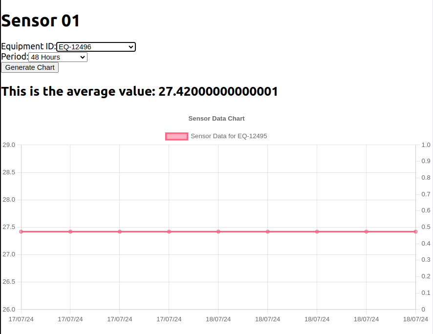

# Projeto para Sensor

Para baixar o projeto e configurar:

- git clone git@github.com:VarnerDamascenoJr/oil-gas-sensor-project.git
- npm install -> dentro de cada pasta.

### Front End
O Front foi construído de forma bem simples, pois, pelo pouco tempo de projeto, foquei bem mais no back end. 
Temos três páginas

/Register
Primeiro o usuário é criado e depois disso ele pode fazer o login e recebe permissão para ir para as consultas.

/Login
Após o registro, pode fazer o login e acessar a página de consultas.

/Home
Na página Home ele tem acesso as consultas. As consultas são determinadas por dois parâmetros: período e id do equipamento. Após o usuário colocar ambos os casos, então ele terá o valor médio do perído, terá os valores totais para aquele período. 

Há uma consulta inicial que lista todos os IDs dos equipamentos. Isto pode ser facilmente expandido para os dias possíveis para os relatórios também. 

### Back End
Para o Back end criei uma estrutura MVC bem simples. Usei Typescript e o banco de dados foi postgres. Também, para facilitar a sua construção como um todo, usei Prima como ORM e também para ajudar nas tipagens e interfaces após as migrações. 

Tive alguns problemas com tipagem, o que afetou os testes, pela falta de tempo, deixei-os incompletos. Embora tenha já feito algumas coisa, só tive certa dificuldade. 

Usei o K6 para a criação dos testes de carga e influx para armazenamento, consulta e criação dos relatórios. A próxima etapa para isto seria usar Grafana, por exemplo.

Poderia ter feito no bash, mas preferi fazer pelos scripts do JS mesmo. Então, temos os scrips para fazer o k6 rodas e gerar o relatório em TXT. Também os testes.

#### Teste de carga
Fiz para alguns end-points, mas poderia ser extendido para todos os end-points. Coloquei o sleep de 1s também. 

#### Prisma
Usei o Prisma para ORM, por ser de mais fácil implementação. Criei apenas dois schemas. 

Foram criados dois controllers, um para as requisições para o gráfico, outra para autenticação autorização. 

### para upload de arquivo csv a partir do end point 

Usei um scrip também para automizar. Nele os dados são inseridos no banco de dados normalmente a partir de uma rota de onde está este arquivo. 

Os arquivos estão nesta estrutura:

equipmentId,timestamp,value
EQ-12495,2023-02-15T01:30:00.000-05:00,78.42
EQ-12495,2023-02-15T01:30:00.000-05:00,785.42
EQ-12495,2023-02-15T01:30:00.000-05:00,783.42

Aqui é a automatização. No primeiro termo é a função, no segundo é o caminho onde está o arquivo.
./upload-csv.sh ./file-test.csv

No caso, o meu arquivo estava dentro pasta home do meu pc, mas é só mudar o caminho para onde se deseja pegá-lo.

#### Automatização

Criei alguns scripts para automatizar, também criei criei o yml e o sh para o deployment. [mas não testei completamente]

Os scripts todos testados, funcionando perfeitamente.

## Sugestões de melhoria no projeto

### Melhorias no Front

- Usar Zod e React-hook-form para validação
- Usar useCallBack, useMemo para melhoria de performance a partir das consultas.
- Uso do Tailwindcss para páginas responsivas com construção mais facilitadas.
- Uso de Storybook para um UX/UI mais interessante para o usuário e construção de componentes com features completas pensando no longo prazo.

### Melhorias para autenticação.
 Bom, um sistema de validação e autenticação robusto pensando no crescimento exponencial do projeto. Para isto podemos usar: Amazon Cognito,Google IAP, Okta e LDAP.

 A idéia poderia ser mais ou menos assim, já implementei algo parecido: 
 #### Opção 1
 Usuários se registram na aplicação através do Amazon Cognito, podendo usar contas sociais ou corporativas via Okta. Okta autentica usuários corporativos e sincroniza com o LDAP para verificar as permissões e grupos de usuários. Após autenticação, os usuários tentam acessar recursos protegidos no Google Cloud[ dei o exemplo do google, mas pode ser qualquer outro ambiente/api com conteúdos sensíveis, o próprio S3...]. Google IAP verifica a identidade do usuário autenticado pelo Cognito e autoriza o acesso com base nas políticas definidas. Okta gerencia SSO e MFA para garantir a segurança dos acessos. LDAP mantém as informações dos usuários e permissões atualizadas, que são sincronizadas com Okta.
#### Opção 2
 Ou podemos fazer um sistem que usa o Auth0, também já tive experiência com ele e usando AWS usando: Auth0, AWS API Gateway, Lambda Authorizer e React.

 ### Melhorias para os relatórios a partir do Grafana

 Bom, para este é mais simples. Além de fazer o teste completo na aplicação ou nos arquivos mais críticos. Use o influxDB e gerei algumas consultas comuns usando bash. Mas o ideal seria integrar o influx com o Grafana e ter uma melhor qualidade na qualidade na exposição dos dados. Naturalmente também a melhoria nas consultas.

 ### Melhoria no desempenho a partir do Redis
 
 O uso do Redis é uma ferramenta essencial para a melhoria nas escalabilidade e tendo como pressuposto o aumento exponencial das requisições. Seria uma etapa importante a implementação de Cache para melhoria das consultas. 

